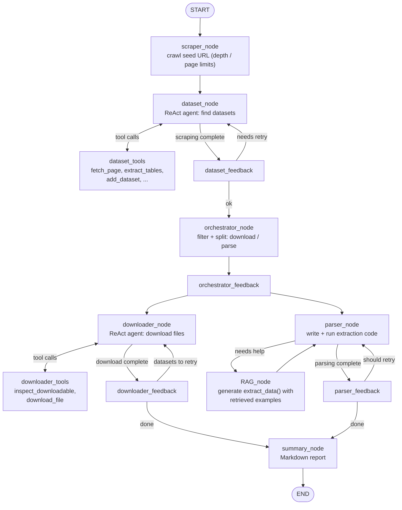

# AgenticDataHub

**A LangGraph multi-agent system that discovers datasets on a website, then downloads them or extracts them from web pages using LLM-generated parsers — and writes a Markdown report of what it collected.**

You give it a seed URL and a research topic. The agents crawl the site, decide which links are relevant datasets, choose whether each one should be *downloaded* (CSV, JSON, XLSX, ZIP…) or *parsed* (HTML tables, JSON APIs, data embedded in scripts), retry when something fails, and summarize the results.

**Stack:** Python · LangGraph · LangChain · vLLM (OpenAI-compatible endpoint) · Playwright · BeautifulSoup · sentence-transformers

---

## Key features

- **Multi-agent LangGraph pipeline** — scraper, dataset discovery, orchestrator, downloader, parser, RAG-assisted parser, and summary nodes sharing one typed state.
- **Autonomous discovery** — a ReAct agent inspects crawled pages and registers datasets with a label, a downloadable/parseable flag, and a 0–1 relevance score.
- **Download vs. parse routing** — the orchestrator filters by relevance (threshold 0.5) and splits datasets into a download bucket and a parse bucket.
- **Tool-using downloader** — verifies each URL before downloading, skips duplicates, and refuses files over 500 MB.
- **Self-writing parsers** — for pages with no downloadable file, the parser agent writes and runs Python extraction code, retrying up to 3 times with the error fed back to the model.
- **RAG memory for parsers** — extractor functions that worked are stored in a local vector index (`all-MiniLM-L6-v2` embeddings) and retrieved as examples when a similar page is parsed later.
- **Feedback loops** — dedicated feedback nodes after discovery, orchestration, download, and parsing can send the flow back for another attempt.
- **Report output** — a Markdown summary with datasets collected, schemas, sample rows, data-quality notes, and suggested next steps.
- **Model-agnostic** — talks to any OpenAI-compatible endpoint. Defaults to `DeepSeek-R1-Distill-Qwen-32B` served by vLLM.

---

## Architecture

The diagram below follows the edges defined in `dataset_agent/pipeline.py`.



### What each node does

| Node | File | Role |
|---|---|---|
| `scraper_node` | `core/scraper_node.py` | Crawls from the seed URL up to `MAX_SCRAPE_DEPTH` hops and `MAX_PAGES_PER_DOMAIN` pages (Playwright + aiohttp). |
| `dataset_node` | `agents/dataset_agent.py` | LLM agent that judges each link and calls `add_dataset(url, label, downloadable, relevance_score)`. |
| `orchestrator_node` | `agents/orchestrator_agent.py` | Re-scores relevance, drops anything below 0.5, deduplicates, and fills `datasets_to_download` / `datasets_to_parse`. |
| `downloader_node` | `agents/downloader_agent.py` | Calls `inspect_downloadable` before `download_file`; records each result as a `DownloadedFile`. |
| `parser_node` | `agents/parser_agent.py` | Inspects the page, generates and executes extraction code, verifies the output file, retries up to 3 times. |
| `RAG_node` | `agents/rag_agent.py` | Generates a reusable BeautifulSoup `extract_data()` function; successful ones are saved to the vector store. |
| `summary_node` | `agents/summary_agent.py` | Produces the final Markdown report. |
| feedback nodes | `feedback/` | After each stage, decide whether to retry (via flags such as `scrape_needs_retry`, `parser_should_retry`, `datasets_to_retry`). Lessons kept in state are injected into later downloader and parser prompts. |

Shared state (`core/state.py`) carries the seed URL and topic, discovered/downloaded/parsed datasets, feedback flags, learned lessons, and the current phase used for routing.

---

## Project structure

```
AgenticDataHub/
└── dataset_agent/
    ├── main.py                  # CLI entrypoint
    ├── pipeline.py              # LangGraph graph definition + routing
    ├── requirements.txt
    ├── .env.example
    ├── agents/                  # dataset, orchestrator, downloader, parser, rag, summary
    ├── core/                    # state schema, LLM factory, scraper node, lesson memory
    ├── tools/                   # scraping, download, and parser tools
    ├── RAG/                     # vector store, routing, site-specific ingestion
    ├── feedback/                # feedback nodes for each stage
    └── loggingstate/            # state logging
```

---

## Setup

### 1. Install

```bash
git clone https://github.com/talha142/AgenticDataHub.git
cd AgenticDataHub/dataset_agent

python -m venv .venv
source .venv/bin/activate        # Windows: .venv\Scripts\activate

pip install -r requirements.txt
playwright install chromium
```

### 2. Start an LLM endpoint

The project calls an OpenAI-compatible chat endpoint. The default configuration expects a local vLLM server, for example:

```bash
vllm serve deepseek-ai/DeepSeek-R1-Distill-Qwen-32B --port 8000
```

`vllm` runs as a separate server; the project itself only needs the endpoint URL.

### 3. Configure

```bash
cp .env.example .env
```

| Variable | Purpose | Default in `.env.example` |
|---|---|---|
| `VLLM_BASE_URL` | Chat endpoint | `http://localhost:8000/v1` |
| `VLLM_API_KEY` | Any string unless your server enforces auth | `token-abc123` |
| `VLLM_MODEL` | Model name the server was started with | `deepseek-ai/DeepSeek-R1-Distill-Qwen-32B` |
| `OUTPUT_DIR` | Where results are written | `./output` |
| `MAX_SCRAPE_DEPTH` | Link hops the crawler may follow | `3` |
| `MAX_PAGES_PER_DOMAIN` | Page cap per domain | `20` |
| `REQUEST_TIMEOUT` | Request timeout (seconds) | `30` |
| `LOG_LEVEL` | Logging level | `INFO` |

---

## Usage

```bash
python main.py --url https://zenodo.org/ --topic "compound mapping"
python main.py --url https://www.ebi.ac.uk/chembl/ --topic "drug discovery"
python main.py --url https://pubchem.ncbi.nlm.nih.gov/ --topic "chemistry compounds" --verbose
```

| Flag | Meaning |
|---|---|
| `--url` | Seed URL to crawl (required) |
| `--topic` | Research topic that guides discovery (required) |
| `--output` | Override the output directory |
| `--verbose` | Stream every LangGraph event |

### Output

Under `OUTPUT_DIR` you get:

- the downloaded dataset files and parsed CSV/JSON files,
- a per-site folder containing `pipeline_state.json` (the full final state),
- `dataset_collection_report.md`, the Markdown report, which is also printed to the console.

---

## Safety notes

- **This project executes LLM-generated Python code** (the parser and RAG nodes run generated extraction code). Run it in a container, VM, or otherwise isolated environment, and do not point it at sources you do not trust.
- Respect each site's terms of service and `robots.txt`, and keep the crawl limits low when testing.

## Current limitations

- The site-specific ingestion in `RAG/` is currently written for PhytoHub, CARD, KEGG, and NPBS; other domains rely on the generic path.
- The vector store is in-memory (persisted to a JSON index), which suits experimentation rather than large collections.
- Quality depends on the model behind the endpoint; smaller models may struggle with the structured tool-call format the agents expect.
- There is no automated test suite yet.

## Future improvements

- Container/sandbox execution for generated code.
- A persistent vector database and evaluation of parser reuse.
- A test suite with recorded pages, and a small web UI or API in front of the pipeline.
